# Create BI Publisher Report from Subject Area

Getting started with Oracle Hospitality Reporting and Analytics

1. [Accessing Reports](#1-accessing-reports)
2. [Creating a BI Publisher Report from a Subject Area](#2-creating-a-bi-publisher-report-from-a-subject-area)

## 1. Accessing Reports

1. Access the R&A Portal application from your instance or the provided instance.
2. From the Portal home page, select on the Reports and Dashboards Tile, alternatively from the drop down menu you can select Reports and Dashboards.

## 2. Creating a BI Publisher Report from a Subject Area

1. From the main Oracle Analytics page, select the Create > Report option

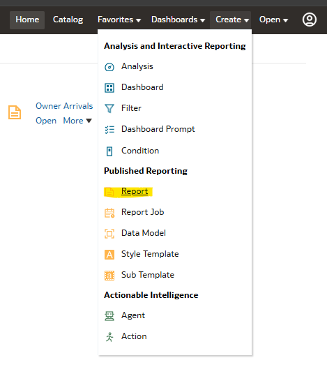

2. From the Create Report popup, click the Use Subject Area option and select the Statistics – Mangers Report subject areas from the list

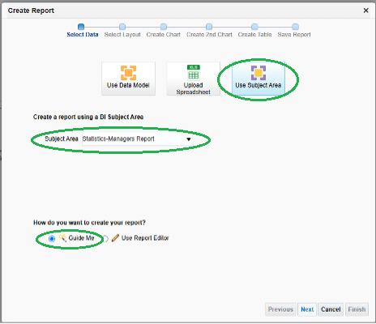

3.	Click the NEXT button

4.	Set Page Options to Landscape and Layout to Table

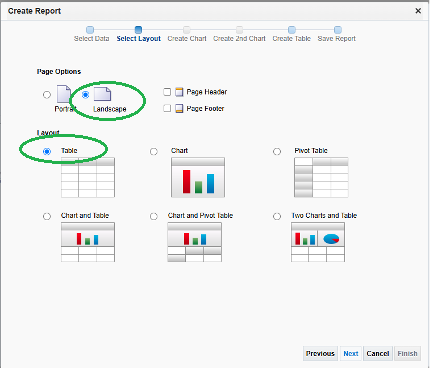

5.	Click the NEXT button

6. Drag and drop the fields listed below from the Subject Area into the table after the last column
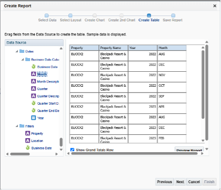

List of fields:

| Fields for BI Report |
| ---------------------------------- |
| Property Details - Property |
| Property Details - Property Name |
| Dates > Business Date Calendar - Year |
| Dates > Business Date Calendar - Month |
| Dates > Business Date Calendar - Business Date |
| Details - Reservation |
| Details - Cancel Reservation	 |
| Room Details - Occupied Rooms |
| Room Details - Arrival Rooms  |
| Room Details - Departure Rooms | 
| Guest Details - Guests In House |
| Guest Details - Arrival Persons |
| Guest Details - Departure Persons |
| Guest Details - VIP Guest |
| Guest Details - Memberships In House Persons |
| Revenue Details - Room Revenue |
| Revenue Details - Average Daily Rate |
| Revenue Details - F&B Revenue |
| Revenue Details - Other Revenue |
| Revenue Details - Total Revenue |
| Revenue Details - Individual Room Revenue |
| Revenue Details - Group Room Revenue |

7.	Click the NEXT button

8.	Select View Report and click Finish

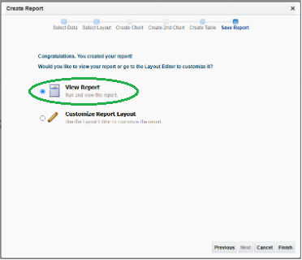

9.	Save report to the Shared Folders/{Org Code}/Training/”YOUR NAME” directory as Managers Report

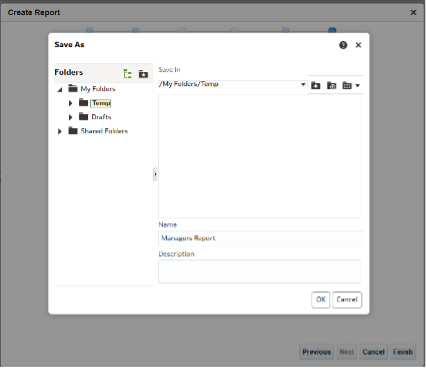

10. Click on Edit Report option

11. Click on Parameters button

12. Under Parameters, click the Green Add option

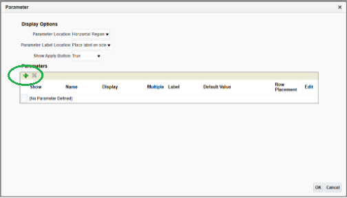

13. Select the Property Details - Property attribute and click on OK

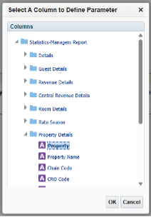

14. Set Display as Choice List and click OK to add parameter

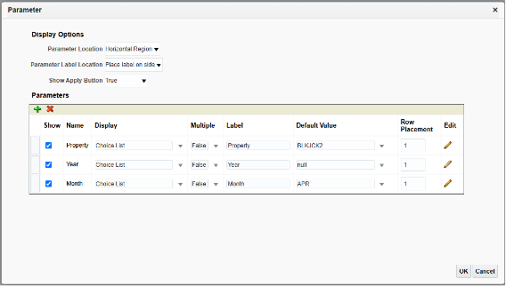

15. Repeat adding the Choice List parameter for the following attributes:
* Dates > Business Date Calendar - Year
* Dates > Business Date Calendar - Month

16. Under Parameters, click the Green Add option and select Dates > Business Date Calendar - Business Date

17. Click OK to use default display of Calendar

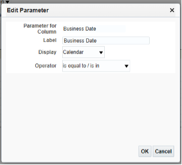

18. Click OK

19. Click on the Properties button and uncheck the Auto Run option

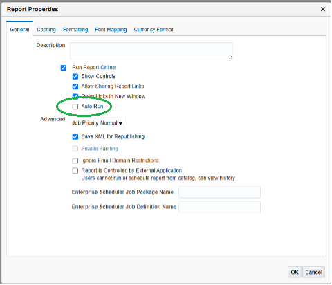

20. Click OK

21. Click the Save Report icon
